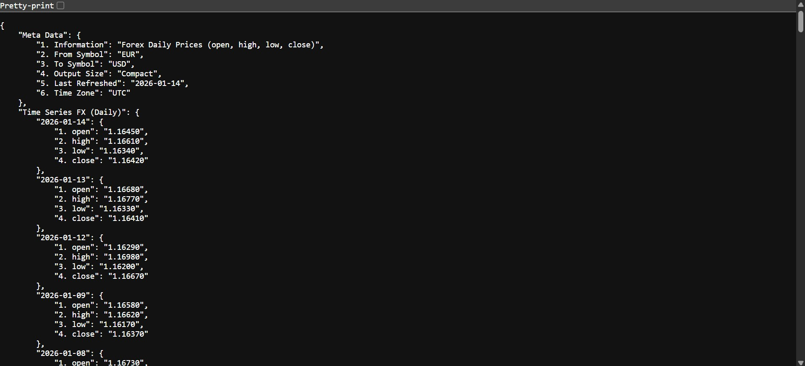
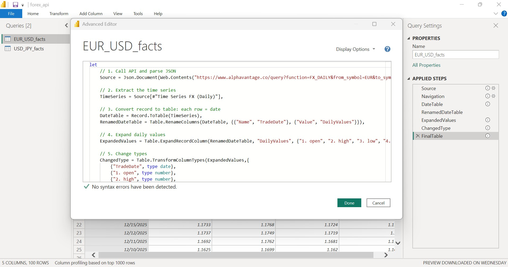
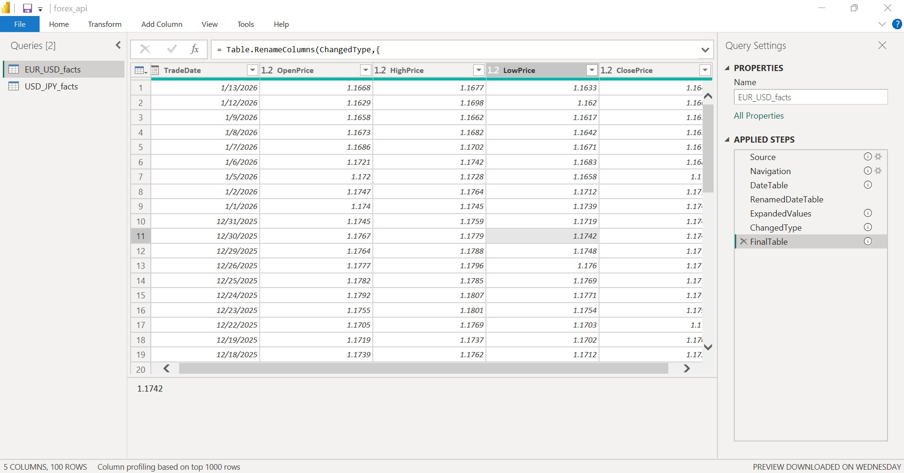
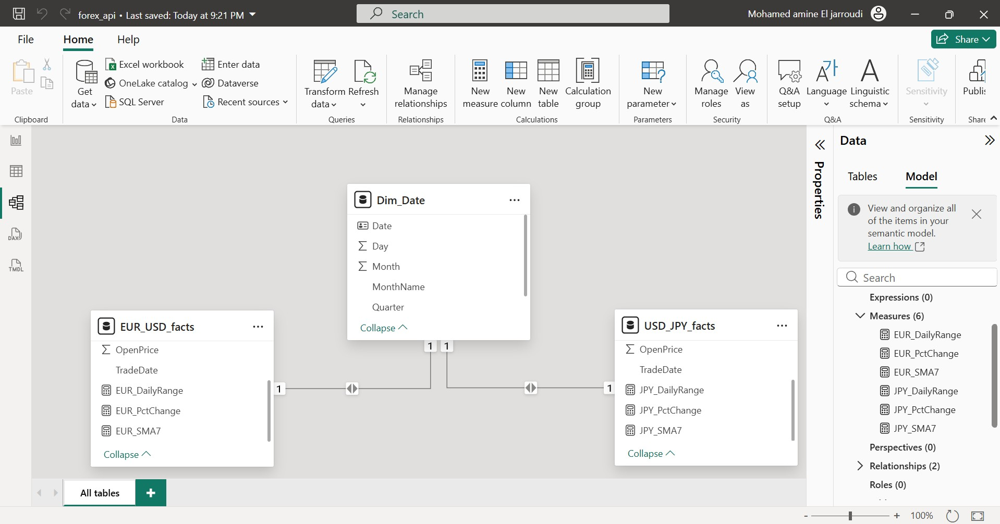
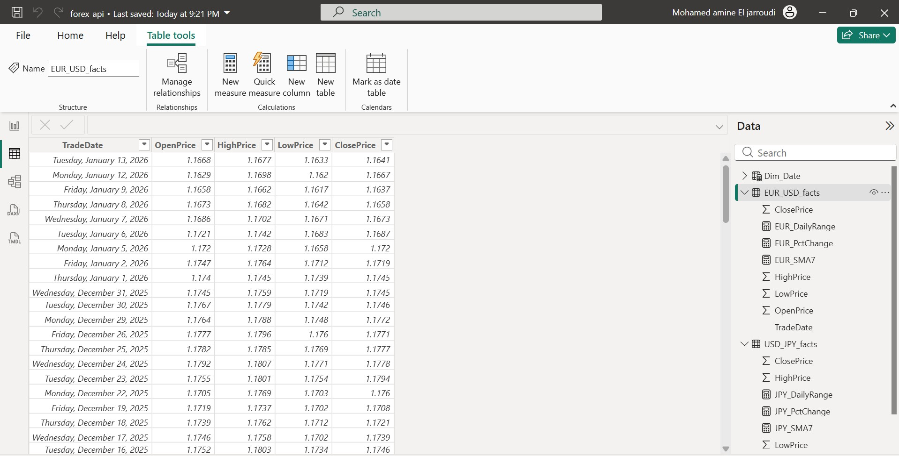
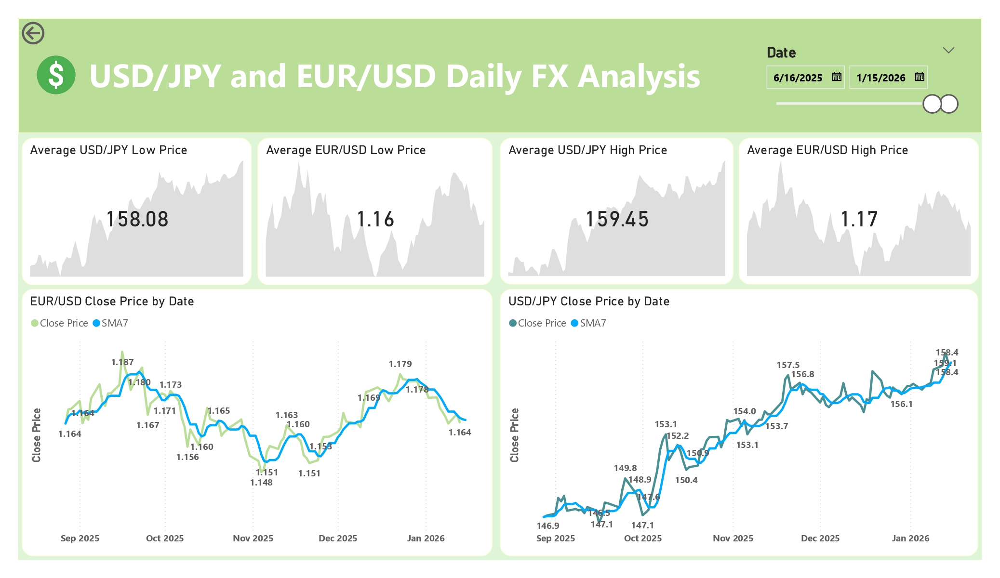

# FX Market Analysis with Power BI and REST APIs

A complete Business Intelligence project focused on analyzing foreign exchange market data using real time REST APIs. This project demonstrates end to end BI skills, from consuming JSON data via public APIs to transforming, modeling, and visualizing financial time series data in Power BI.

The dashboard provides daily price trend analysis, volatility insights, and moving average indicators for major FX pairs, enabling exploratory market analysis and technical insight generation.

---

## 📊 Project Overview

This project analyzes daily foreign exchange rates for two major currency pairs:

* EUR/USD
* USD/JPY

The data is sourced directly from the **Alpha Vantage REST API**, returned in **JSON format**, and processed entirely within **Power Query**. The final output is an interactive Power BI dashboard that allows users to explore price movements, volatility, and short term trends using time based slicing.

### Key objectives

* Work with real API based data instead of static files
* Parse and transform nested JSON structures
* Build fact tables from time series API responses
* Apply time intelligence using a shared date dimension
* Create financial indicators using DAX
* Design a clean and analytical FX dashboard

---

## 🛠️ Methodology

This project was built end to end, starting from REST API calls and finishing with a production ready Power BI dashboard.

---

## 1. Data Extraction (REST API)

### Data Source

* Provider: Alpha Vantage
* Endpoint Type: REST API
* Format: JSON
* Frequency: Daily FX prices

### APIs Used

**EUR/USD**

```
https://www.alphavantage.co/query?function=FX_DAILY&from_symbol=EUR&to_symbol=USD&apikey=YOUR_API_KEY
```

**USD/JPY**

```
https://www.alphavantage.co/query?function=FX_DAILY&from_symbol=USD&to_symbol=JPY&apikey=YOUR_API_KEY
```

Each API response contains a nested JSON object where daily prices are stored under the `Time Series FX (Daily)` field.

### Raw JSON API Response

Below is an example of the raw JSON data returned by the Alpha Vantage API.



---

## 2. Data Cleaning and Transformation (Power Query)

All ETL operations were performed inside **Power Query Editor**.

### Key transformation steps

* API call using `Web.Contents`
* JSON parsing using `Json.Document`
* Extraction of nested time series records
* Conversion of JSON records into tabular format
* Data type enforcement
* Column renaming for analytical clarity

### Power Query M Code (EUR/USD Example)

The following screenshot shows a snippet from the Power Query Advanced Editor M code used to extract and transform the EUR/USD data.



### Power Query Queries Overview

This view shows the two FX queries created in Power Query.



---

## 3. Data Model

### Fact Tables

* EUR_USD_facts
* USD_JPY_facts

Grain: one row per currency pair per trading day.

### Dimension Table

* Dim_Date

  * Standard calendar table used for time intelligence

### Relationships

* One to many relationship between `Dim_Date[Date]` and each FX fact table
* Active relationships used for DAX time calculations

### Data Model View



---

## 4. Data Validation

The table view below confirms that the EUR/USD fact table was loaded correctly with clean and typed data.



---

## 5. DAX Measures and Calculations

Measures were created independently for each fact table due to separate datasets.

### Simple Moving Average (7 Day)

```DAX
SMA7 =
CALCULATE(
    AVERAGE(EUR_USD_facts[ClosePrice]),
    DATESINPERIOD(
        Dim_Date[Date],
        LASTDATE(Dim_Date[Date]),
        -7,
        DAY
    )
)
```

### Daily Percentage Change

```DAX
PctChange =
VAR PrevClose =
    CALCULATE(
        MAX(EUR_USD_facts[ClosePrice]),
        DATEADD(Dim_Date[Date], -1, DAY)
    )
VAR CurrentClose =
    MAX(EUR_USD_facts[ClosePrice])
RETURN
DIVIDE(CurrentClose - PrevClose, PrevClose)
```

### Daily Price Range (Volatility Proxy)

```DAX
DailyRange =
MAX(EUR_USD_facts[HighPrice])
- MIN(EUR_USD_facts[LowPrice])
```

Equivalent measures were created for the USD/JPY fact table.

---

## 6. Dashboard Development

A single page interactive Power BI dashboard was designed to visualize both FX pairs side by side.

### Key Visuals

* Close price trends by date
* 7 day moving average overlay
* Average daily high and low price KPI cards
* Date range slicer using Dim_Date

### Interactive Features

* Unified date slicer controlling all visuals
* Clear separation of EUR/USD and USD/JPY analytics
* Financial friendly number formatting
* Minimalist design focused on trend analysis

### Dashboard Preview



---

## 💡 Key Insights

* EUR/USD exhibits relatively lower volatility compared to USD/JPY during the selected period
* USD/JPY shows stronger directional trends and wider daily ranges
* Moving averages smooth short term noise and highlight trend reversals
* Date slicing allows focused analysis during high volatility periods

---

## 📂 Repository Contents

* `FX_Market_Analysis.pbix`
* `FX_Market_Analysis_Dashboard.pdf`
* `README.md`
* `dashboard_preview.jpg`
* `data_extraction_script.jpg`
* `data_model.jpg`
* `EUR_data.jpg`
* `JSON_data.jpg`
* `power_query.jpg`

---

## 💻 Tools Used

* Power BI Desktop
* Power Query Editor
* REST APIs
* JSON
* DAX

---

## 📓 Data Source

Alpha Vantage
Public Financial Market Data API

---

## 📄 License

This project is part of a personal BI portfolio and is intended for educational and demonstration purposes only.

---
